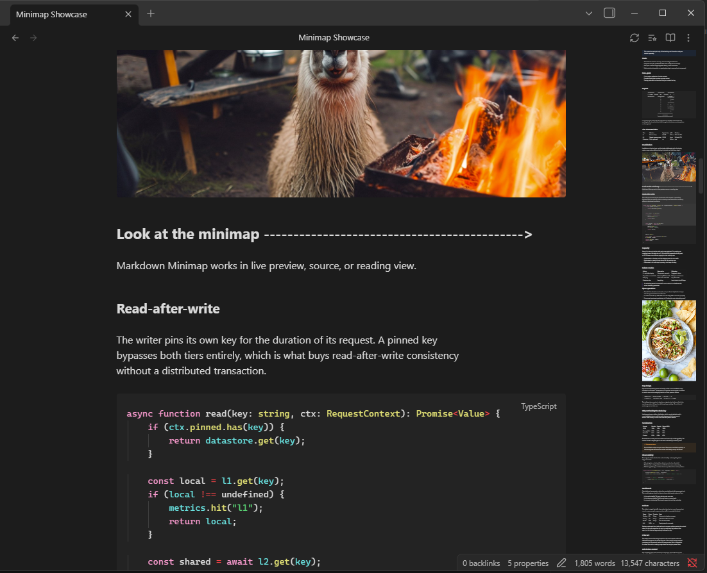

# 🗺️ Markdown Minimap

A minimap for your Markdown notes, inside the editor pane. Like the minimap in
a code editor, it gives you a scaled-down view of the whole note so you can see
its shape and jump anywhere in it.



## Why this one

Most minimap implementations clone the editor's DOM, which means they only ever
capture the part of the note that is currently on screen — Obsidian virtualizes
long notes, so past a certain length the minimap stops being a usable scrollbar.

Markdown Minimap renders the whole note independently, and spends most of its
effort on a harder problem: making the minimap agree with the note. The panel is
laid out at the note's own text width, margins, line height and font, and the
scroll position is mapped through anchors shared by both, rather than by
scaling the document by a single ratio. On a 14,000-word note that is the
difference between the viewport marker landing where you expect and landing 150
pixels away.

## ✨ Features

- 🔎 **Whole-note view** at any length, not just the rendered portion
- 🖱️ **Click or drag** anywhere in the minimap to jump there
- 🖲️ **Scroll wheel** over the minimap scrolls the note
- 🎯 **Mode-aware** — Live Preview, Source and Reading each get a faithful map
- 🌓 **Follows your theme**, including custom fonts, heading sizes and snippets
- 🔁 **Per-note toggle** and refresh, from the note header or the command palette
- 📏 **Resizes** with the pane

## 📦 Installation

### From Community Plugins

`Settings` → `Community Plugins` → `Browse` → search for **Markdown Minimap** →
`Install`, then `Enable`.

### Manually

Download `main.js`, `manifest.json` and `styles.css` from the
[latest release](https://github.com/Nymbo/Markdown-Minimap/releases) and put
them in `<your vault>/.obsidian/plugins/markdown-minimap/`.

## 🧪 Usage

Open any note and the minimap appears at the right edge of the pane.

- **Click** anywhere on it to jump to that point
- **Drag** the viewport marker to scroll continuously
- **Scroll** over it with the wheel to scroll the note
- **Toggle** it per note with the button in the note header, or bind
  `Toggle minimap for current note` to a hotkey

The viewport marker has three states, mirroring a code editor: barely visible at
rest, legible when the pointer is over the minimap, and strongest while you are
dragging it.

## ⚙️ Settings

| Setting | What it does |
| --- | --- |
| Enable by default | Whether new notes open with the minimap shown |
| Scale | Size of the minimap, 0.05–0.3 of actual size |
| Opacity | Background opacity of the minimap panel |
| Slider opacity | Viewport marker opacity while hovering; the idle and dragging states scale from it |
| Top / bottom offset | Clearance for plugin toolbars or bottom chrome |
| Scrollbar gap | Distance between the minimap and the editor's scrollbar |
| Minimum viewport height | Floor for the viewport marker, so it stays grabbable in long notes |
| Shift note content left | Moves the note's text away from the minimap |
| Center on click | Whether clicking centres the viewport on that point, or puts it at the top |

### 💡 Giving the minimap room

If the minimap crowds your text, raise **Shift note content left** and turn on
`Settings` → `Editor` → `Readable line length`. Thanks to
[@2590812378](https://github.com/Nymbo/Markdown-Minimap/issues/3) for
suggesting this, originally as a CSS snippet.

## 📌 How it works

Most of the work in this plugin is in making the minimap and the note agree.
These are the parts worth knowing about.

**Whole-note rendering.** Obsidian virtualizes long notes, so a minimap built by
cloning the editor's DOM only ever sees the visible portion. Markdown Minimap
renders the note's full source separately, with no hidden helper views and no
iframes.

**Faithful layout.** The panel uses the note's own text width, top margin, line
height and font size, so lines wrap where they wrap in the note rather than at
the pane's full width.

**Source mode shows source.** With Live Preview off, Obsidian prints the file
verbatim. The minimap does the same — one element per source line, taking each
line's height from CodeMirror itself, rather than rendering Markdown the note
isn't showing. Line for line, this mode is exact.

**Properties.** Obsidian's Markdown renderer emits frontmatter as a hidden block
and never builds the properties widget, so properties would take up space in the
note and none in the minimap. The minimap reproduces them and pins the block to
the height they actually occupy — the widget, the raw YAML, or nothing,
according to what the note is showing.

**Code blocks.** A rendered `<pre>` is inset on both sides while an editor code
line is inset only on the left. Left alone that wraps wide code — ASCII diagrams
especially — one column early, which both scrambles them and inflates the note's
mapped height. The minimap matches the editor's box.

**Blank lines.** Markdown collapses consecutive blank lines when rendered. They
are re-inserted as inert spacers sized from CodeMirror's line blocks, so
deliberate whitespace survives.

**Scroll mapping.** Scaling the note by a single ratio assumes the minimap grows
at the same rate the note does, which it doesn't — small per-block differences
accumulate into hundreds of pixels over a long note. Instead both coordinate
spaces are anchored to positions that exist in each, and positions between them
are interpolated. If the source headings and rendered ones ever disagree in
count, it falls back to the global ratio rather than risk a wrong pairing.
Reading view virtualizes its sections, so it uses the global ratio.

## 🛠️ Development

```bash
npm install
npm run build
```

`npm run dev` watches and rebuilds `main.js`. Source lives in `src/`:

| File | Contents |
| --- | --- |
| `main.ts` | Plugin lifecycle, workspace events, commands |
| `minimap.ts` | The minimap itself — rendering, measurement, scroll sync |
| `anchors.ts` | Heading extraction and the piecewise scroll mapping |
| `source-lines.ts` | Source-mode line classification |
| `blank-lines.ts` | Blank-line runs, frontmatter and fence scanning |
| `settings.ts` | Settings model and tab |
| `utils.ts` | Small shared helpers |

## 💡 Contributing

Bug reports and feature requests are welcome — open an
[issue](https://github.com/Nymbo/Markdown-Minimap/issues). Screenshots help a
lot for anything visual, as does the note's view mode, since the three modes
take different paths through the code.

## License

[MIT](LICENSE) © Devan Eckert.
